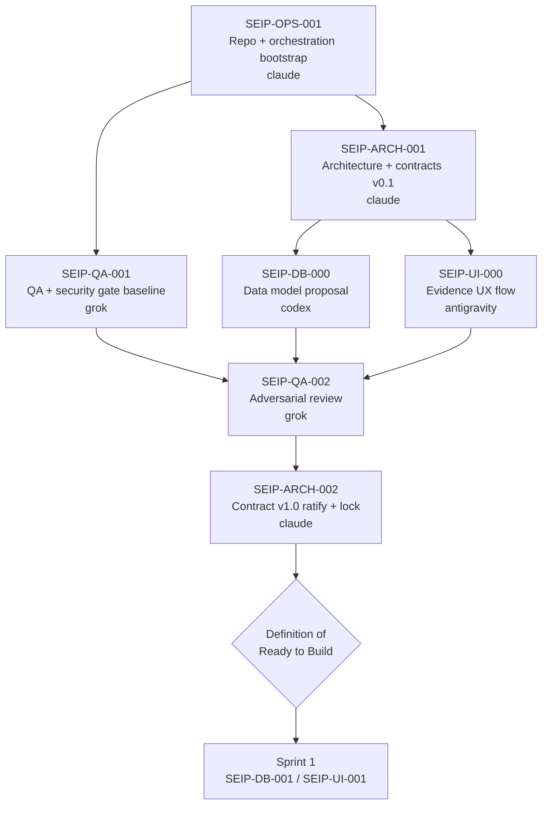

# Sprint 0 — Multi-AI Team Operating System

> **PARTIALLY SUPERSEDED by ADR-0004 (2026-07-17).** SEIP is now developed solely
> by Claude Code. The multi-agent mechanics in this plan (dispatch, file locks,
> per-agent waves, cross-agent handoffs, SEIP-QA-002) are retired. What survives:
> the task sequence (contracts → designs → gates → lock), the Hard Constraint
> below, and the Definition of Ready to Build reinterpreted for one developer.
> Current sequence lives in `.ai-team/task-board.yaml` + `PROJECT_STATE.md`.

Status: Planned 2026-07-16 · rescoped by ADR-0004 on 2026-07-17
Planned by: Claude (Lead Architect)
Date: 2026-07-16

## Sprint Goal

ทำให้ "ระบบแบ่งงาน" ใช้งานได้จริง ก่อนที่ AI ตัวใดจะเขียน production feature

An agent must be able to receive a task ID and physically start work — on its own branch, with its own locked paths, against an approved contract — without colliding with another agent. Sprint 0 ends when that is true and demonstrable.

## Hard Constraint

**No production feature code in Sprint 0.**

Prohibited in this sprint, for every agent:
- Business logic in `apps/**` or `packages/**`
- `prisma/schema.prisma` entities, migrations, or any executed migration
- UI screens, components, or design-token implementation
- Automated test code against features that do not exist yet

Sprint 0 produces **decisions, contracts, designs, gates, and scaffolding** only. Scaffolding (git, CI skeleton, CODEOWNERS, directory structure) is explicitly *not* a production feature and is the point of the sprint.

## Why Sprint 0 Cannot Be Skipped — Findings From The Document Review

The docs describe a complete operating system. The repository cannot currently execute any of it.

| # | Finding | Impact | Resolved by |
|---|---|---|---|
| F1 | `D:\laragon\www\aischool` is **not a git repository**. Only `docs/` and `aischool-docs.zip` exist. | Every rule in the plan depends on git: `ai/<agent>/<task-id>` branches, `.worktrees/`, protected `main`/`develop`, PR gates. Zero of it is executable. No agent can obey its own instructions. | SEIP-OPS-001 |
| F2 | `CLAUDE.md` and `AGENTS.md` live in `docs/`, not at repo root. | Claude Code auto-loads `CLAUDE.md` from the repo root; Codex looks for `AGENTS.md` at the root. In their current location **neither file is loaded by the tool it was written for**. The instructions are inert. | SEIP-OPS-001 |
| F3 | Agents are told to read `.ai-team/task-board.yaml`; the board actually sits at `docs/.ai-team/task-board.yaml`. | Every path reference in every agent instruction file resolves to nothing. | ADR-0002 → SEIP-OPS-001 |
| F4 | `AGENTS.md` and `ANTIGRAVITY.md` reference contracts at `contracts/**`; ownership files and the task board say `docs/contracts/**`. | Two agents are pointed at a directory that does not exist. | ADR-0002 |
| F5 | Grok owns `docs/reviews/**` (per `GROK.md` + `module-ownership.yaml`), but the directory that exists is `docs/reports/` (empty). | Grok has no place to file reviews. | ADR-0002 |
| F6 | The contracts named in `contract-policy.md` — `openapi.yaml`, `events.yaml`, `permissions.yaml`, `error-codes.yaml` — **do not exist**. | `SEIP-DB-001` and `SEIP-UI-001` both depend on contracts and are on the board as buildable. They are not. Antigravity is forbidden to invent API fields, and has no fields to use. | SEIP-ARCH-001 |
| F7 | `SEIP-DB-001` reviewer is `claude`; `module-ownership.yaml` says the backend module reviewer is `grok`. | Ambiguous review authority on the highest-risk module. | ADR-0002 |
| F8 | Ownership gaps: `.ai-team/**` has **no owner**; `infra/docker/**`, `tests/frontend/**`, `scripts/security/**`, `scripts/orchestration/**`, `.github/**` appear in instruction files but not in `module-ownership.yaml`. | The lock/ownership model has holes exactly where two agents would collide. | ADR-0002 |
| F9 | No task owns repository bootstrap or the CI skeleton. Workstream A names "CI skeleton" but no task exists for it. | The blocking work is unassigned. | SEIP-OPS-001 |
| F10 | No ADR exists; `docs/decisions/` is empty. The stack was never formally decided. | Four agents would each assume a stack. | ADR-0001 |

**F1, F2 and F6 together are the reason for your instruction.** If an agent started `SEIP-DB-001` today it would commit to no branch, against no contract, with no review path, under instructions its own tool never loaded.

## Sprint 0 Task Sequence

Sequenced as waves, not dates — there is no velocity history to estimate from. A wave starts only when the previous wave is `approved`.

| Wave | Task | Owner | Reviewer | Output |
|---|---|---|---|---|
| 0 | SEIP-OPS-001 | claude | grok | Executable repository + operating system |
| 1 | SEIP-ARCH-001 | claude | grok | Module boundaries + contracts v0.1 (draft) |
| 1 | SEIP-QA-001 | grok | claude | Runnable gate definitions + severity model |
| 2 | SEIP-DB-000 | codex | grok | ERD + entity dictionary + backend feasibility findings |
| 2 | SEIP-UI-000 | antigravity | claude | Evidence submission UX flow + frontend feasibility findings |
| 3 | SEIP-QA-002 | grok | claude | Adversarial findings + APPROVE / CHANGES_REQUESTED verdict |
| 4 | SEIP-ARCH-002 | claude | grok | Contracts v1.0 locked |

Waves 1–3 are a direct implementation of the approval flow already written in `contracts/contract-policy.md`: Claude drafts → Codex validates backend feasibility → Antigravity validates frontend usability → Grok validates errors/permissions/edge cases → Claude approves and locks. Sprint 0 runs that loop once, on paper, before any code exists to be wrong.

## Definition of Ready to Build (Sprint 0 Exit Gate)

Sprint 1 does not open until **all** of these are true:

1. `git log` shows `main` and `develop` exist and no agent has committed directly to either.
2. Each of the four agents' instruction files is loaded by its own tool from the repo root.
3. `.ai-team/task-board.yaml`, `module-ownership.yaml`, and `file-locks.yaml` resolve at the paths the instruction files name.
4. Every path in `module-ownership.yaml` has exactly one owner; no path is owned twice; no referenced path is unowned.
5. `openapi.yaml`, `events.yaml`, `permissions.yaml`, `error-codes.yaml` exist, are v1.0, and are locked.
6. Every gate in `docs/qa/QUALITY-GATES.md` has a runnable command and a CI job that executes it.
7. A throwaway branch has passed the full gate pipeline end to end (pipeline proven, not assumed).
8. `SEIP-QA-002` verdict is APPROVE.
9. ADR-0001 and ADR-0002 are Accepted.
10. Each Sprint 0 task has a handoff in `.ai-team/handoffs/<task-id>.md`.

Item 7 matters most: a green CI on a real branch is the only evidence that the operating system works. Everything else is a claim.

## Open Questions — Must Be Closed Before Sprint 1

These are unresolved in the current documents and each one blocks real work.

| ID | Question | Blocks | Status |
|---|---|---|---|
| OPEN-1 | ~~Is there a git remote?~~ | SEIP-OPS-001 CI design | **CLOSED 2026-07-16: GitHub.** Branch protection + PR gates are server-side via GitHub; CI = GitHub Actions. |
| OPEN-2 | ~~Which evaluation framework and indicator set?~~ | SEIP-DB-000 depth | **CLOSED 2026-07-16: วPA — ว9/2564 (ครู) + ว10/2564 (ผู้บริหาร).** See ADR-0003 and `architecture/evaluation-framework.md`. |
| OPEN-3 | **Which AI provider, and may personal data leave the country?** `system-context.md` lists an AI provider as an external actor and `PROJECT_STATE.md` records that evidence contains personal data. Under PDPA that combination needs an explicit, recorded decision. | AI mapping contracts (Sprint 2) | open — user + claude |
| OPEN-4 | **Which object storage?** "Video storage can grow quickly" is a recorded risk with no decision. DPA evidence includes mp4 teaching videos, so this is not hypothetical. | SEIP-DB-000 storage strategy | open — user + codex |
| OPEN-5 | **No workstream owns AI-mapping contracts.** Workstream F exists in the plan; no task exists on the board. | Sprint 2 | open — claude |

OPEN-1 and OPEN-2 are closed; neither remaining question blocks Sprint 0 waves 0–4. OPEN-4 should close before SEIP-DB-000 finalizes its storage strategy; OPEN-3 before any AI-mapping contract is drafted.

## Risks Carried Into Sprint 0

- **Bootstrap is single-threaded on Claude.** SEIP-OPS-001 blocks all three other agents. Mitigation: it is scoped to scaffolding only and reviewed by Grok, not expanded mid-flight.
- **Contract lock may be premature** if OPEN-2 stays open — indicators shape the mapping contract. Mitigation: `SEIP-ARCH-002` locks v1.0 only for the entities that are actually understood; the mapping contract is explicitly deferred to Sprint 2 rather than guessed.
- **`docs/` currently duplicates `aischool-docs.zip`.** The zip is untracked and will drift from the tree once git exists. Mitigation: SEIP-OPS-001 decides to track or delete it. It is not deleted without your say-so.

## Work Orders

| Task | Work Order |
|---|---|
| SEIP-OPS-001 | `.ai-team/work-orders/SEIP-OPS-001.md` |
| SEIP-DB-000 | `.ai-team/work-orders/SEIP-DB-000.md` |
| SEIP-UI-000 | `.ai-team/work-orders/SEIP-UI-000.md` |
| SEIP-QA-001 | `.ai-team/work-orders/SEIP-QA-001.md` |
| SEIP-QA-002 | `.ai-team/work-orders/SEIP-QA-002.md` |

`SEIP-ARCH-001` and `SEIP-ARCH-002` are Claude-owned and specified in this plan and in ADR-0001/ADR-0002; they receive work orders when Wave 1 opens.
